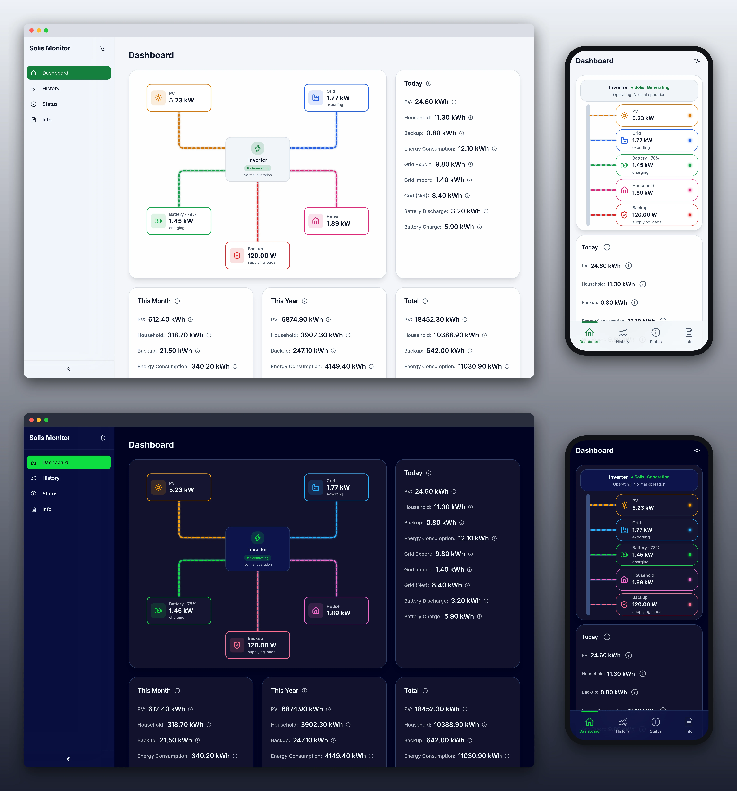

[](https://github.com/dombyte/solis/blob/master/LICENSE)
[](https://github.com/dombyte/solis/actions/workflows/checks.yml)
[](https://github.com/dombyte/solis)
[](https://github.com/dombyte/solis/tags/)

# Solis Monitor

Monitoring for Solis hybrid inverters over Modbus (TCP or RTU). One Go binary polls the
inverter, stores daily energy and status/fault changes in SQLite, computes monthly/yearly/total
values, and serves a React dashboard (REST + WebSocket).




## Quick start (Docker)

```bash
cp example/docker-compose.yaml docker-compose.yaml   # or docker-compose.rtu.yaml for RS485
cp example/config.yaml config.yaml                   # set modbus.address
docker compose up -d
```

Open `http://<host>:8080`. API docs (Swagger UI) are at `/docs`.

- Set `TZ` (e.g. `Europe/Berlin`) in the compose file; the timezone never comes from the config.
- **Keep a restart policy** (`restart: unless-stopped`, or systemd `Restart=on-failure`): the app
  restarts failed components itself up to 3 times, then exits with code 1 so a fresh process
  starts. A normal `SIGTERM`/`SIGINT` exits 0 (bounded to 30 s).

Without Docker: `make build && ./solis` (linux/darwin; the database lock uses `flock`).

## Configuration

[`example/config.yaml`](example/config.yaml) is the commented template. The app reads
`./config.yaml`; pass `-config <path>` before the subcommand to use another file
(`solis -config /etc/solis.yaml`, `solis -config /etc/solis.yaml backfill`). Every option can be
overridden with `SOLIS_` + its path, e.g. `SOLIS_MODBUS_ADDRESS=tcp://192.168.1.200:502`.
Invalid values fail startup.

Durations need a unit: `s`, `m`, `h`, `d`, `w`, `y`, combinable (`1y6w`). A bare number is
rejected.

| Option | Default | Description |
|--------|---------|-------------|
| `app.debug` | INFO | Log level: DEBUG, INFO, WARN, ERROR, FATAL |
| `app.port` | 8080 | HTTP port |
| `app.timeout` | 30s | Request and storage-call timeout (≥ 1s) |
| `poller.interval` | 30s | Poll interval (≥ 1s) |
| `poller.block_attempts` | 3 | Retries per register block after a failed read |
| `poller.block_retry_delay` | 1s | Delay between retries of a block |
| `poller.block_interval` | 0s | Delay between block reads |
| `poller.poll_timeout` | 30s | Max duration of one poll; `poll_timeout + modbus.timeout` must be < 3 × `interval` |
| `modbus.address` | tcp://192.168.1.100:502 | `tcp://host:port` or `rtu://<device>` (e.g. `rtu:///dev/ttyUSB0`) |
| `modbus.timeout` | 5s | Connect/read timeout |
| `modbus.slave_id` | 1 | Unit ID (1–247) |
| `modbus.speed` / `data_bits` / `parity` / `stop_bits` | 19200 8N2 | Serial settings (RTU only) |
| `rollover.time` | 23:59 | Local time the inverter resets its daily counters (strict `HH:MM`) |
| `storage.path` | ./data/solis.db | Database file |
| `storage.daily_retention` | 10y | Daily rows; monthly/yearly rows follow it |
| `storage.error_retention` | 10y | Status/fault rows |
| `storage.wal_mode` | true | SQLite WAL |
| `storage.synchronous` | NORMAL | OFF, NORMAL, FULL, EXTRA |
| `storage.temp_store` | MEMORY | DEFAULT, FILE, MEMORY |
| `storage.enable_backup` | true | Periodic backups (a pre-migration backup is always taken) |
| `storage.max_backups` | 3 | Backups to keep (0 = all) |
| `storage.backup_interval` | 24h | Backup interval |
| `storage.cleanup_interval` | 24h | Retention cleanup interval |

**Backups** go to `backups/` next to the database, are integrity-checked and rotated. To
restore: stop the app, copy the backup over `solis.db`, delete `solis.db-wal` and `solis.db-shm`.

**Retention** never breaks computed values: the current year and anything still needed to
recompute totals are always kept.

## Upgrading

The database is migrated on startup after a verified pre-migration backup. v3 only
migrates from the v2 schema:

| Running now | Schema | Upgrade path |
|---|---|---|
| nothing (fresh install) | – | v3 directly |
| v2.0.0, v2.1.0 | 2 | v3 directly |
| v1.4.0 | 1 | start v2.1.0 once, stop it, then v3 |
| v1.0.0 – v1.3.x | none | start v2.1.0 once, stop it, then v3 |
| a newer release | > 3 | refused; run the newer release or restore a backup |

An older database makes v3 exit with `schema version N is older than 2; upgrade with a v2
release first`. The v2 step also renames the register keys (e.g. `pv_today_energy` →
`pv_energy_daily`), which v3 relies on.

## Registers

`GET /api/keys` lists every register with its metadata.

| Group | Keys |
|-------|------|
| Daily energy (polled) | `pv_energy`, `battery_charge`, `battery_discharge`, `grid_import`, `grid_export`, `energy_consumption`, `household_energy`, `backup_energy` — each as `_daily` |
| Computed energy | the same eight as `_monthly`, `_yearly`, `_total` (summed from daily rows) |
| Net grid (computed) | `grid_energy_daily/_monthly/_yearly/_total` = export − import |
| Status/faults (history on change) | `solis_status`, `operating_status`, `grid_fault_1`, `backup_fault_2`, `battery_fault_3`, `device_fault_4`, `device_fault_5`, `battery_fault_1_bms`, `battery_fault_2_bms` |
| Live power (not stored) | `pv_total_power`, `grid_power` (+ = export), `battery_soc`, `battery_power`, `battery_current_direction`, `battery_power_signed` (+ = charging), `household_load_power`, `backup_load_power` |

Addresses, types and scales are defined in `internal/solis/table.go`.

## API

### REST

```
GET /health                                            # 200 ok|degraded, 503 failed
GET /api/keys                                          # all registers + metadata
GET /api/version                                       # build info (binary, UI and docs)
GET /api/data/{key}                                    # current value
GET /api/data/{daily_key}?start=2024-01-01&end=2024-01-31
GET /api/data/{monthly_key}?start=2024-01&end=2024-12
GET /api/data/{yearly_key}?start=2023&end=2024
GET /api/data/{status_key}                             # decoded change history
```

`start`/`end` accept `YYYY-MM-DD`, `YYYY-MM` or `YYYY` (default: last 30 days). Errors:
`{"error": "Bad Request", "message": "…", "code": 400}`. Values are rounded to 2 decimals in
the response only.

`/health` turns **503** once a component restart failed, a core part (storage, event bus, HTTP
server) failed, or the supervisor stalled; a first failure only reports `degraded`.

### WebSocket (`/ws`)

Subscribe to keys; only changed values are pushed (coalesced every ~75 ms):

```json
→ { "type": "subscribe",   "keys": ["pv_total_power", "solis_status"] }
← { "type": "snapshot",    "values": { "pv_total_power": { "value": 5230, "timestamp": "…", "unit": "W" } } }
← { "type": "update",      "ts": "…", "values": { "pv_total_power": { "value": 5102.5 } } }
← { "type": "update",      "ts": "…", "values": {}, "removed": ["battery_power_signed"] }
→ { "type": "unsubscribe", "keys": ["solis_status"] }
← { "type": "error",       "code": "unknown_keys", "keys": ["foo"] }
```

Same-origin only; max 256 clients and 256 keys per message. History is REST only.

## Security

Built for a trusted LAN: **no authentication**. No CORS on REST, same-origin WebSocket,
`nosniff` and `no-referrer` headers; framing is allowed (e.g. Home Assistant iframe). Put an
authenticating reverse proxy in front before exposing it to the internet.

## CLI

`solis` without arguments runs the server. Maintenance jobs run against the database and exit
0/1:

```bash
solis backfill --years 2           # recompute monthly + yearly for this year + 2 closed years
solis backfill --years 2 --force   # also overwrite periods without complete daily history
solis version
```

`backfill` needs the server stopped (it refuses while the database is locked), takes a verified
backup first, runs in one transaction and prints an `old -> new` line per value plus a
summary. Without `--force` it skips periods older than the first stored daily row; it always
refuses periods whose daily rows retention already deleted.

## Development

```bash
make all             # web assets + binary (the UI and API docs are embedded)
make build           # binary with version info; embeds the assets of the last `make assets`
make check           # format, lint, race tests, deadcode, govulncheck (check-only)
make docker          # dev image with version info (docker-compose.dev.yaml)
docker compose -f docker-compose.dev.yaml up

cd frontend && npm install
npm run dev                                         # proxies /api and /ws to :8080
npm run typecheck && npm run lint && npm run knip
```

Architecture and conventions: [`AGENTS.md`](AGENTS.md).

## License

MIT — see [LICENSE](LICENSE).
